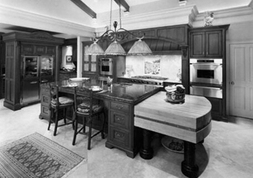
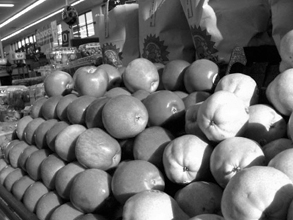
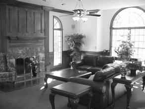
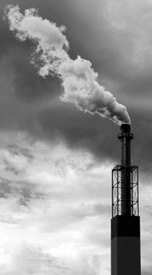
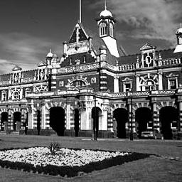
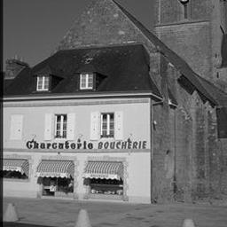
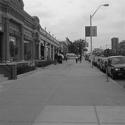
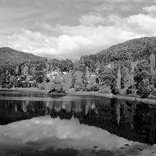
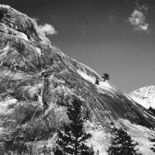
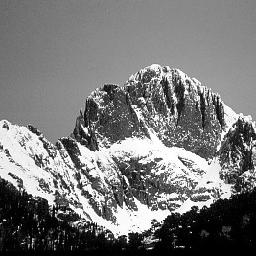

# 翁笠群 105061272

# Project 3 : Scene recognition with bag of words

## Overview
In this project , we will learn about the basic technique of bag of words models for image classification. The model classifies based on a histogram of the frequency of visual words , which is established by clustering a large corpus of local features. By this method , we can improve the performance of the image recognition.

## Implementation
### 1. Tiny images
Due to large size of image and long-time training , we resize the original image to a 16x16 resolution , so as to accelarate the process of extracting SIFT features<br>
and I use `Image.ANTIALIAS` to avoid image aliasing when downsampling the images.
```python
N = len(image_paths)
size = 16
tiny_images = np.zeros((N, size**2)) 

    for i in range(N): 
        image = Image.open(image_paths[i]) 
        image = image.resize((size,size), Image.ANTIALIAS) 
        image = np.asarray(image) 
        image = image.flatten() 
        image = (image - np.mean(image))/np.std(image) 
        tiny_images[i, :] = image 
```


### 2. Vocabulary building
This part almost completed in sample code , so I only modify the hyperparameter `step`<br>
```python
bag_of_features = []
    print("Extract SIFT features")
    for path in image_paths:
        img = np.asarray(Image.open(path),dtype='float32')
        frames, descriptors = dsift(img, step=[3,3], fast=True)
        bag_of_features.append(descriptors)
    bag_of_features = np.concatenate(bag_of_features, axis=0).astype('float32')
    start_time = time()
    vocab = kmeans(bag_of_features, vocab_size, initialization="PLUSPLUS")        
    end_time = time()
    print("It takes %.2f s to build vocabulary."%(end_time-start_time)) 
```
for step = [5,5] [6,6] [10,10] and [15,15] , with timing and accuracy (model : linear SVM)

<table border=0 cellpadding=0 cellspacing=0>
<tr>
<th>Step</th>
<th>[3,3]</th>
<th>[5,5]</th>
<th >[6,6]</th>
<th >[8,8]</th>
<th >[10,10]</th>
</tr>
<tr>
<td>Timing</td>
<td><font color=pink>3254s<font></td>
<td>1173s</td>
<td>812.8s</td>
<td>459.8s</td>
<td><font color=cyan>285.9s<font></td>
</tr>
<tr>
<td>Accuracy</td>
<td><font color=cyan>0.73067<font></td>
<td>0.69934</td>
<td>0.704</td>
<td>0.67934</td>
<td><font color=pink>0.652<font></td>
</tr>
</table>

by these results , we observe the tradeoff between **time complexity** & **performance**


### 3. Bags of SIFTs
In this part , we use `vocab.pkl` , which represents "the bag of words" , to generate features for both training and testing images
```python
vocab = pickle.load(open('vocab.pkl','rb')) 
    d = len(vocab) 
    image_feats = []
    start_time = time() 
    for path in image_paths: 
        img = np.asarray(Image.open(path), dtype='float32') 
        frames, descriptors = dsift(img, step=[3,3], fast=True) 
        dist = distance.cdist(vocab, descriptors, 'euclidean') 
        feat = np.argmin(dist, axis=0) 
        hist, bins = np.histogram(feat, bins=range(0,d+1)) 
        norm = np.linalg.norm(hist) 
        if norm == 0: 
            image_feats.append(hist) 
        else: 
            image_feats.append(hist/norm)
    image_feats = np.array(image_feats)
    end_time = time() 
    print("It takes %.2f s to extract feature."%(end_time-start_time)) 
```
### 4. K-nearest neighber
This part will predict the category for every test image by finding the training image with most similar features , and a hyperparameter `k` can be adjusted to increase performance
```pythom
k = 5
    dist_matrix = distance.cdist(test_image_feats, train_image_feats, 'euclidean') 
    test_predicts = [] 
    for i in range(test_image_feats.shape[0]): 
        dist = dist_matrix[i, :] 
        dist_sort = np.argsort(dist) 
        neighbors = [] 
        for j in range(k): 
            neighbors.append(dist_sort[j]) 
        classVotes = {} 
        for j in range(k): 
            response = train_labels[neighbors[j]] 
            if response in classVotes: 
                classVotes[response] = classVotes[response] + 1 
            else: 
                classVotes[response] = 1 
        sortedVotes = sorted(classVotes.items(), key=operator.itemgetter(1), reverse=True) 
        test_predicts.append(sortedVotes[0][0])
```
for k = 3, 5, 7, 9, 11 and accuracy (step=[3,3])

<table border=0 cellpadding=0 cellspacing=0>
<tr>
<th>k</th>
<th>3</th>
<th>5</th>
<th>7</th>
<th>9</th>
<th>11</th>
</tr>
<tr>
<td>Accuracy</td>
<td>0.568</td>
<td><font color=cyan>0.574</font></td>
<td>0.56867</td>
<td>0.56734</td>
<td>0.56067</td>
</tr>
</table>

### 5. Linear SVM
This function will train a set of linear SVMs and find hyperplanes for multi-class classification.<br>
However , we import `LinearSVC` to complete this function , and we only need to choose an appropriate value `C` , which controls the torlerance of margin.
```python
svm = LinearSVC(C=3.0, class_weight=None, dual=True, fit_intercept=True,
                    intercept_scaling=1, loss='squared_hinge', max_iter=1000,
                    multi_class='ovr', penalty='l2', random_state=0, tol=0.0001, verbose=0) 
    svm.fit(train_image_feats, train_labels) 
    pred_label = svm.predict(test_image_feats) 
```
for C = 0.1, 0.5, 1.0, 3.0, 5.0, 10 and accuracy (step=[3,3])

<table border=0 cellpadding=0 cellspacing=0>
<tr>
<th>C</th>
<th>0.1</th>
<th>0.5</th>
<th>1.0</th>
<th>3.0</th>
<th>5.0</th>
<th>10</th>
</tr>
<tr>
<td>Accuracy</td>
<td>0.65</td>
<td>0.71867</td>
<td>0.72737</td>
<td><font color=cyan>0.73067</font></td>
<td>0.72467</td>
<td>0.72267</td>
</tr>
</table>

## Results
### 1.Tiny images + KNN
the best performance = **0.23534** , with k = 11.<br>
<table border=0 cellpadding=0 cellspacing=0>
<tr>
<th>Category name</th>
<th>Kitchen</th>
<th>Store</th>
<th>Bedroom</th>
<th>LivingRoom</th>
<th>Office</th>
<th>Industrial</th>
<th>Suburb</th>
<th>InsideCity</th>
</tr>
<tr>
<td>Accuracy</td>
<td>0.04</td>
<td>0.0</td>
<td>0.13</td>
<td>0.1</td>
<td>0.2</td>
<td>0.06</td>
<td>0.44</td>
<td>0.06</td>
</tr>
<tr>
<th>Category name</th>
<th>TallBuilding</th>
<th>Street</th>
<th>Highway</th>
<th>OpenCountry</th>
<th>Coast</th>
<th>Mountain</th>
<th>Forest</th>
</tr>
<tr>
<td>Accuracy</td>
<td>0.21</td>
<td>0.54</td>
<td>0.73</td>
<td>0.35</td>
<td>0.35</td>
<td>0.21</td>
<td>0.11</td>
</tr>
</table><br>


### 2.Bag of SIFT + KNN
the best performance = **0.574** ,  with step=[3,3] , k=5.<br>
<table border=0 cellpadding=0 cellspacing=0>
<tr>
<th>Category name</th>
<th>Kitchen</th>
<th>Store</th>
<th>Bedroom</th>
<th>LivingRoom</th>
<th>Office</th>
<th>Industrial</th>
<th>Suburb</th>
<th>InsideCity</th>
</tr>
<tr>
<td>Accuracy</td>
<td>0.43</td>
<td>0.54</td>
<td>0.27</td>
<td>0.32</td>
<td>0.88</td>
<td>0.38</td>
<td>0.92</td>
<td>0.43</td>
</tr>
<tr>
<th>Category name</th>
<th>TallBuilding</th>
<th>Street</th>
<th>Highway</th>
<th>OpenCountry</th>
<th>Coast</th>
<th>Mountain</th>
<th>Forest</th>
</tr>
<tr>
<td>Accuracy</td>
<td>0.44</td>
<td>0.65</td>
<td>0.79</td>
<td>0.44</td>
<td>0.59</td>
<td>0.57</td>
<td>0.96</td>
</tr>
</table><br>


### 3.Bag of SIFT + Linear SVM
the best performance = **0.73067** , with step=[3,3] , C=3.0.<br>
<table border=0 cellpadding=0 cellspacing=0>
<tr>
<th>Category name</th>
<th>Kitchen</th>
<th>Store</th>
<th>Bedroom</th>
<th>LivingRoom</th>
<th>Office</th>
<th>Industrial</th>
<th>Suburb</th>
<th>InsideCity</th>
</tr>
<tr>
<td>Accuracy</td>
<td>0.67</td>
<td>0.63</td>
<td>0.51</td>
<td>0.52</td>
<td>0.92</td>
<td>0.57</td>
<td>0.94</td>
<td>0.64</td>
</tr>
<tr>
<th>Category name</th>
<th>TallBuilding</th>
<th>Street</th>
<th>Highway</th>
<th>OpenCountry</th>
<th>Coast</th>
<th>Mountain</th>
<th>Forest</th>
</tr>
<tr>
<td>Accuracy</td>
<td>0.79</td>
<td>0.76</td>
<td>0.82</td>
<td>0.62</td>
<td>0.8</td>
<td>0.83</td>
<td>0.94</td>
</tr>
</table><br>


## Visualization
| Category name | Accuracy | Sample training images | Sample true positives | False positives with true label | False negatives with wrong predicted label |
| :-----------: | :------: | :--------------------: | :-------------------: | :-----------------------------: | :----------------------------------------: |
| Kitchen | 0.67 |  |  |  |  |
| Store | 0.63 |  |  |  |  |
| Bedroom | 0.51 |  |  |  |  |
| LivingRoom | 0.52 |  |  |  |  |
| Office | 0.92 |  |  |  |  |
| Industrial | 0.57 |  |  |  |  |
| Suburb | 0.94 |  |  |  |  |
| InsideCity | 0.64 |  |  |  |  |
| TallBuilding | 0.79 |  |  |  |  |
| Street | 0.76 |  |  |  |  |
| Highway | 0.82 |  |  |  |  |
| OpenCountry | 0.62 |  |  |  |  |
| Coast | 0.8 |  |  |  |  |
| Mountain | 0.83 |  |  |  |  |
| Forest | 0.94 |  |  |  |  |

